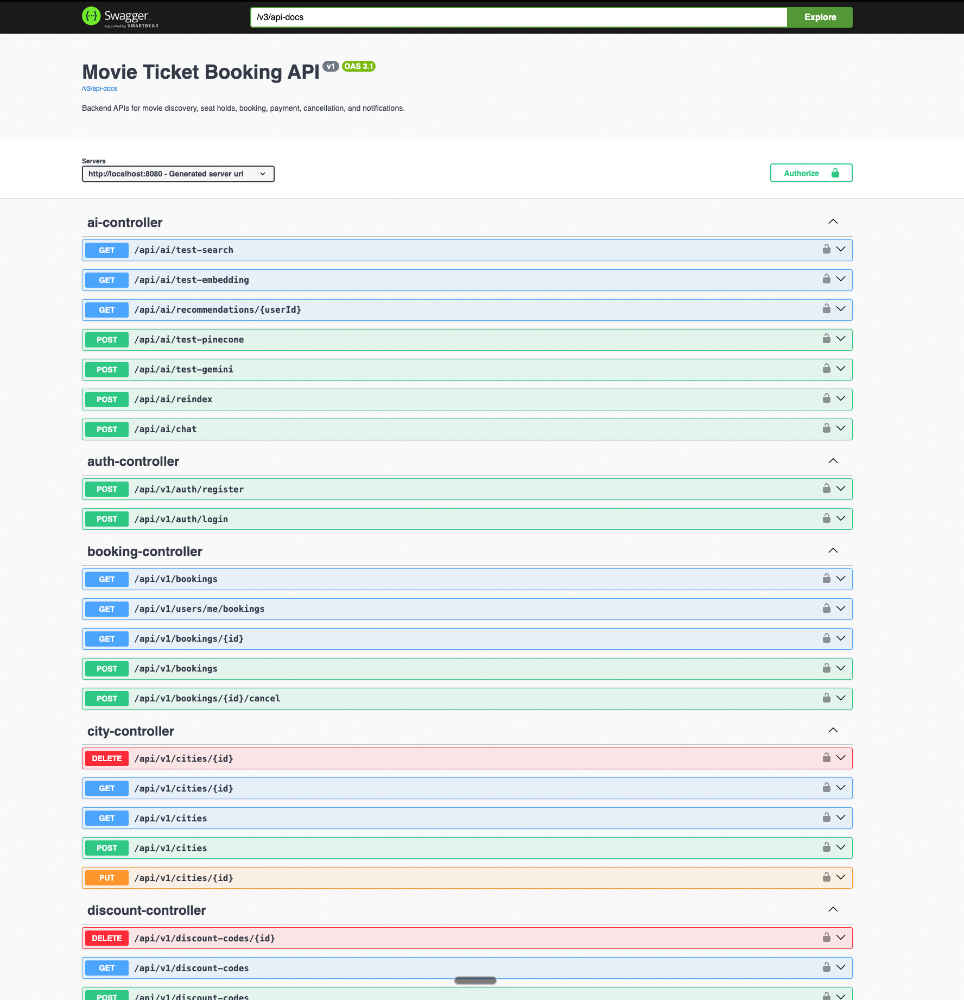
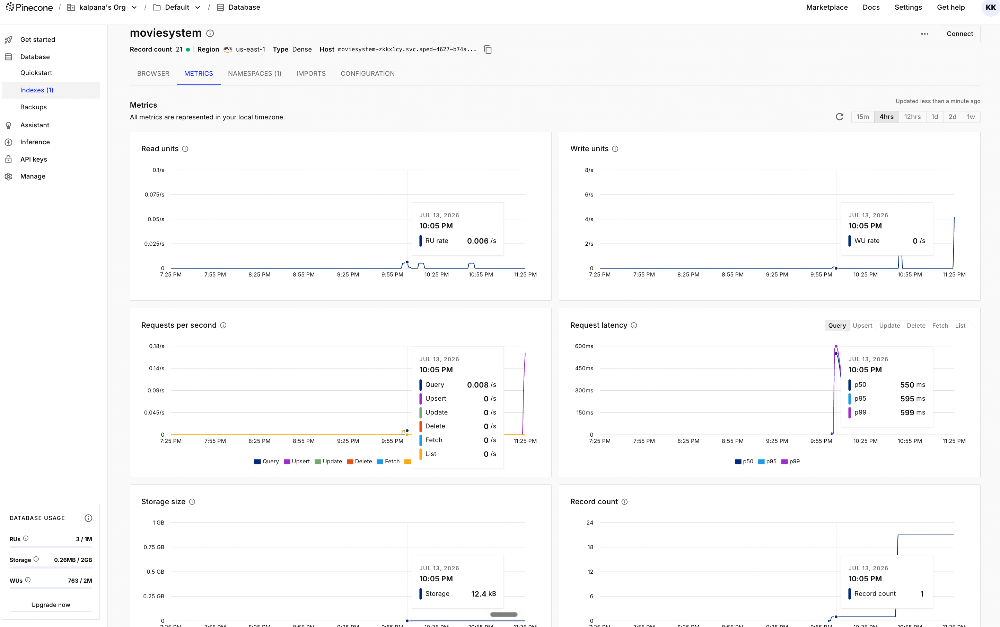

# Movie Ticket Booking System

## Overview

This project is a scalable backend application for an online movie ticket booking platform built using **Java 21** and **Spring Boot 3.5.16**. The primary objective was to design a production-oriented backend capable of handling seat-level concurrency, configurable pricing and refund rules, asynchronous event processing, and AI-powered movie recommendations.

The system supports multiple cities, multiple theatres within each city, multiple screens per theatre, and multiple shows for each screen. Customers can browse movies, reserve seats through a time-bound hold mechanism, complete payments, cancel bookings according to configurable refund policies, and receive asynchronous notifications.

To make the project more than a traditional CRUD application, an AI-powered recommendation engine has been integrated using **Google Gemini** and **Pinecone Vector Database**. Movie metadata is converted into semantic embeddings, indexed into Pinecone, and retrieved through similarity search to generate personalized recommendations using Retrieval-Augmented Generation (RAG).

The project intentionally follows clean architectural principles, strong separation of concerns, and extensible design patterns to resemble how a backend service would be structured in a production environment.

---

# Objectives

The primary goals while designing this system were:

* Design a scalable RESTful backend application.
* Prevent double-booking under concurrent seat selection.
* Separate business rules from infrastructure concerns.
* Demonstrate event-driven backend design.
* Keep the architecture modular and extensible.
* Integrate modern AI capabilities without affecting the core booking workflow.
* Maintain readability, testability, and maintainability.

---

# Key Features

## Customer Features

* User Registration & Login using JWT Authentication
* Browse Movies
* Browse Cities
* Browse Theatres
* Browse Shows
* View Available Seats
* Seat Hold with Automatic Expiration
* Booking Confirmation
* Booking Cancellation
* Booking History
* Payment Processing (Simulated)
* AI-Based Movie Recommendations

---

## Admin Features

* Manage Cities
* Manage Theatres
* Manage Screens
* Manage Seats
* Manage Movies
* Manage Shows
* Configure Pricing Rules
* Configure Discount Codes
* Configure Refund Policies
* View Bookings
* Manage Users

---

# Technical Highlights

The implementation focuses on backend engineering concepts commonly found in large-scale systems.

Major areas include:

* Layered Architecture
* REST API Design
* Spring Security with JWT
* PostgreSQL Persistence
* Hibernate/JPA
* Optimistic Locking
* Time-bound Seat Holds
* Event-Driven Processing
* Asynchronous Notifications
* Configurable Pricing Strategies
* Configurable Refund Strategies
* Validation
* Exception Handling
* AI Recommendation Engine

---

# Technology Stack

| Layer           | Technology                  |
| --------------- | --------------------------- |
| Language        | Java 21                     |
| Framework       | Spring Boot 3.5.16          |
| Security        | Spring Security + JWT       |
| Database        | PostgreSQL                  |
| ORM             | Spring Data JPA / Hibernate |
| Documentation   | OpenAPI / Swagger           |
| Build Tool      | Maven                       |
| AI Model        | Google Gemini               |
| Vector Database | Pinecone                    |
| IDE             | IntelliJ IDEA               |
| Testing         | JUnit 5, Mockito            |
| Version Control | Git & GitHub                |

---

# High-Level Architecture

The application follows a traditional layered architecture where each layer has a single responsibility.

```text
                REST APIs
                     │
                     ▼
              Controller Layer
                     │
                     ▼
               Service Layer
                     │
      ┌──────────────┼──────────────┐
      ▼              ▼              ▼
 Pricing       Booking Flow     AI Engine
                     │
                     ▼
             Repository Layer
                     │
                     ▼
                PostgreSQL

                     │
                     ▼
             Spring Events
                     │
                     ▼
          Async Notification Layer

                     │
                     ▼
          Gemini + Pinecone (AI)
```

Business logic remains inside the Service layer while Controllers are intentionally kept thin. Persistence concerns are isolated within repositories and all external integrations are encapsulated behind dedicated service abstractions.

---

# AI Recommendation Engine

One of the major additions to this assignment is an AI-powered recommendation engine built using **Google Gemini** and **Pinecone**.

Instead of relying on keyword matching, the recommendation system uses semantic search.

The workflow is:

```text
Movie
    │
    ▼
Generate Embedding (Gemini)
    │
    ▼
Store Vector (Pinecone)
    │
    ▼
Customer Booking History
    │
    ▼
Generate User Preference Embedding
    │
    ▼
Similarity Search
    │
    ▼
Relevant Movies Retrieved
    │
    ▼
Gemini Recommendation Generation
```

### Why this approach?

A traditional recommendation engine generally relies on exact genre or language matching. Such systems are limited because they cannot understand semantic similarity between movies.

Using embeddings enables the system to identify movies that are conceptually similar, allowing recommendations based on themes, storytelling style, or overall context rather than exact metadata.

---

# Project Structure

The project is organized using feature-based layering.

```text
config
constant
controller
dto
entity
event
exception
listener
mapper
repository
scheduler
security
service
strategy
util
validation
```

Each package has a well-defined responsibility, making the project easier to maintain and extend.

---

# Design Principles

The implementation emphasizes the following engineering principles:

* Single Responsibility Principle
* Separation of Concerns
* Dependency Injection
* Open/Closed Principle
* Composition over Inheritance
* Domain-Driven Package Organization
* Event-Driven Communication
* Interface-Based Design

The overall goal was to build a backend that is modular, testable, and easy to evolve without introducing unnecessary complexity.

---

# Scalability Considerations

Although the assignment explicitly excludes distributed systems, the design intentionally avoids decisions that would make future scaling difficult.

Examples include:

* UUID-based identifiers for all entities.
* Optimistic locking for concurrent updates.
* Asynchronous processing for notifications.
* Strategy-based business rules.
* Event-driven side effects.
* Decoupled AI integration.
* Repository abstraction for persistence.
* Service abstraction for business logic.

These choices allow the application to evolve toward a microservice or distributed architecture with minimal redesign while remaining simple enough for the scope of this assignment.


# Movie Ticket Booking System

## Overview

This project is a scalable backend application for an online movie ticket booking platform built using **Java 21** and **Spring Boot 3.5.16**. The primary objective was to design a production-oriented backend capable of handling seat-level concurrency, configurable pricing and refund rules, asynchronous event processing, and AI-powered movie recommendations.

The system supports multiple cities, multiple theatres within each city, multiple screens per theatre, and multiple shows for each screen. Customers can browse movies, reserve seats through a time-bound hold mechanism, complete payments, cancel bookings according to configurable refund policies, and receive asynchronous notifications.

To make the project more than a traditional CRUD application, an AI-powered recommendation engine has been integrated using **Google Gemini** and **Pinecone Vector Database**. Movie metadata is converted into semantic embeddings, indexed into Pinecone, and retrieved through similarity search to generate personalized recommendations using Retrieval-Augmented Generation (RAG).

The project intentionally follows clean architectural principles, strong separation of concerns, and extensible design patterns to resemble how a backend service would be structured in a production environment.

---

# Objectives

The primary goals while designing this system were:

* Design a scalable RESTful backend application.
* Prevent double-booking under concurrent seat selection.
* Separate business rules from infrastructure concerns.
* Demonstrate event-driven backend design.
* Keep the architecture modular and extensible.
* Integrate modern AI capabilities without affecting the core booking workflow.
* Maintain readability, testability, and maintainability.

---

# Key Features

## Customer Features

* User Registration & Login using JWT Authentication
* Browse Movies
* Browse Cities
* Browse Theatres
* Browse Shows
* View Available Seats
* Seat Hold with Automatic Expiration
* Booking Confirmation
* Booking Cancellation
* Booking History
* Payment Processing (Simulated)
* AI-Based Movie Recommendations

---

## Admin Features

* Manage Cities
* Manage Theatres
* Manage Screens
* Manage Seats
* Manage Movies
* Manage Shows
* Configure Pricing Rules
* Configure Discount Codes
* Configure Refund Policies
* View Bookings
* Manage Users

---

# Technical Highlights

The implementation focuses on backend engineering concepts commonly found in large-scale systems.

Major areas include:

* Layered Architecture
* REST API Design
* Spring Security with JWT
* PostgreSQL Persistence
* Hibernate/JPA
* Optimistic Locking
* Time-bound Seat Holds
* Event-Driven Processing
* Asynchronous Notifications
* Configurable Pricing Strategies
* Configurable Refund Strategies
* Validation
* Exception Handling
* AI Recommendation Engine

---

# Technology Stack

| Layer           | Technology                  |
| --------------- | --------------------------- |
| Language        | Java 21                     |
| Framework       | Spring Boot 3.5.16          |
| Security        | Spring Security + JWT       |
| Database        | PostgreSQL                  |
| ORM             | Spring Data JPA / Hibernate |
| Documentation   | OpenAPI / Swagger           |
| Build Tool      | Maven                       |
| AI Model        | Google Gemini               |
| Vector Database | Pinecone                    |
| IDE             | IntelliJ IDEA               |
| Testing         | JUnit 5, Mockito            |
| Version Control | Git & GitHub                |

---

# High-Level Architecture

The application follows a traditional layered architecture where each layer has a single responsibility.

```text
                REST APIs
                     │
                     ▼
              Controller Layer
                     │
                     ▼
               Service Layer
                     │
      ┌──────────────┼──────────────┐
      ▼              ▼              ▼
 Pricing       Booking Flow     AI Engine
                     │
                     ▼
             Repository Layer
                     │
                     ▼
                PostgreSQL

                     │
                     ▼
             Spring Events
                     │
                     ▼
          Async Notification Layer

                     │
                     ▼
          Gemini + Pinecone (AI)
```

Business logic remains inside the Service layer while Controllers are intentionally kept thin. Persistence concerns are isolated within repositories and all external integrations are encapsulated behind dedicated service abstractions.

---

# AI Recommendation Engine

One of the major additions to this assignment is an AI-powered recommendation engine built using **Google Gemini** and **Pinecone**.

Instead of relying on keyword matching, the recommendation system uses semantic search.

The workflow is:

```text
Movie
    │
    ▼
Generate Embedding (Gemini)
    │
    ▼
Store Vector (Pinecone)
    │
    ▼
Customer Booking History
    │
    ▼
Generate User Preference Embedding
    │
    ▼
Similarity Search
    │
    ▼
Relevant Movies Retrieved
    │
    ▼
Gemini Recommendation Generation
```

### Why this approach?

A traditional recommendation engine generally relies on exact genre or language matching. Such systems are limited because they cannot understand semantic similarity between movies.

Using embeddings enables the system to identify movies that are conceptually similar, allowing recommendations based on themes, storytelling style, or overall context rather than exact metadata.

---

# Project Structure

The project is organized using feature-based layering.

```text
config
constant
controller
dto
entity
event
exception
listener
mapper
repository
scheduler
security
service
strategy
util
validation
```

Each package has a well-defined responsibility, making the project easier to maintain and extend.

---

# Design Principles

The implementation emphasizes the following engineering principles:

* Single Responsibility Principle
* Separation of Concerns
* Dependency Injection
* Open/Closed Principle
* Composition over Inheritance
* Domain-Driven Package Organization
* Event-Driven Communication
* Interface-Based Design

The overall goal was to build a backend that is modular, testable, and easy to evolve without introducing unnecessary complexity.

---

# Scalability Considerations

Although the assignment explicitly excludes distributed systems, the design intentionally avoids decisions that would make future scaling difficult.

Examples include:

* UUID-based identifiers for all entities.
* Optimistic locking for concurrent updates.
* Asynchronous processing for notifications.
* Strategy-based business rules.
* Event-driven side effects.
* Decoupled AI integration.
* Repository abstraction for persistence.
* Service abstraction for business logic.

These choices allow the application to evolve toward a microservice or distributed architecture with minimal redesign while remaining simple enough for the scope of this assignment.

# Security

Security is implemented using **Spring Security** with **JWT-based authentication**.

The application follows a stateless authentication model where each request is independently authenticated using a signed JSON Web Token.

Authentication flow:

```text
User Login
      │
      ▼
Validate Credentials
      │
      ▼
Generate JWT
      │
      ▼
Client stores token
      │
      ▼
Authorization: Bearer <JWT>
      │
      ▼
JWT Authentication Filter
      │
      ▼
Spring Security Context
```

Only authenticated users can access protected resources. Authorization decisions are enforced using role-based access control.

---

# Authorization

The application supports two roles:

## ADMIN

Administrators manage the complete platform configuration.

Capabilities include:

* Manage Cities
* Manage Theaters
* Manage Screens
* Manage Seats
* Manage Movies
* Manage Shows
* Configure Pricing Rules
* Configure Discount Codes
* Configure Refund Policies
* View all bookings
* Manage users

---

## CUSTOMER

Customers interact only with their own resources.

Capabilities include:

* Browse catalog
* Create seat holds
* Book seats
* Cancel bookings
* View booking history
* View notifications

Ownership validation is enforced so that a customer cannot access another customer's bookings or seat holds.

---

# REST API Design

The project follows resource-oriented REST principles.

The API is grouped according to business domains.

Examples include:

```text
/api/v1/auth
/api/v1/users
/api/v1/cities
/api/v1/theaters
/api/v1/screens
/api/v1/seats
/api/v1/movies
/api/v1/shows
/api/v1/seat-holds
/api/v1/bookings
/api/v1/payments
/api/v1/discount-codes
/api/v1/refund-policies
/api/v1/notifications
```

OpenAPI (Swagger) documentation is available for all endpoints, making the APIs easy to explore and test.

---

# Validation

Input validation is handled using **Jakarta Bean Validation**.

Typical validations include:

* Required fields
* String length constraints
* Future show timings
* Valid seat numbers
* Valid UUID references
* Enum validation

Validation occurs before entering the business layer, ensuring that service methods only receive valid requests.

---

# Exception Handling

The application exposes consistent error responses through a centralized `GlobalExceptionHandler`.

Custom exceptions include:

* ResourceNotFoundException
* ValidationException
* ConflictException
* UnauthorizedException
* ForbiddenException
* SeatUnavailableException
* PaymentFailedException
* BusinessException

Using centralized exception handling keeps controller code clean and provides consistent API responses.

---

# Asynchronous Processing

Certain operations should not increase the response time of booking APIs.

To achieve this, Spring Application Events are used to publish domain events after successful transactions.

Examples include:

* BookingConfirmedEvent
* BookingCancelledEvent
* PaymentCompletedEvent
* PaymentFailedEvent
* SeatHoldCreatedEvent
* SeatHoldExpiredEvent

Dedicated listeners process these events asynchronously.

Examples of asynchronous tasks:

* Notification persistence
* Notification delivery
* Future analytics
* Audit logging

This keeps booking APIs responsive while maintaining loose coupling between components.

---

# Scheduler

The application contains a scheduler responsible for automatic seat hold expiration.

The scheduler runs periodically and performs the following steps:

1. Find expired active seat holds.
2. Lock the corresponding records.
3. Mark the hold as expired.
4. Release associated show seats.
5. Publish a `SeatHoldExpiredEvent`.

The implementation is idempotent, ensuring that processing the same hold multiple times does not create inconsistent state.

---

# AI Recommendation Engine

The recommendation engine combines semantic search with Large Language Models.

Instead of matching movies purely by genre or language, the system understands semantic similarity between movie descriptions.

The workflow is:

```text
Movie Metadata
      │
      ▼
Gemini Embedding API
      │
      ▼
3072-dimensional Vector
      │
      ▼
Pinecone Vector Database
      │
      ▼
Similarity Search
      │
      ▼
Relevant Movies
      │
      ▼
Gemini Recommendation
      │
      ▼
Recommendation Response
```

This Retrieval-Augmented Generation (RAG) approach separates knowledge retrieval from language generation, producing recommendations based on semantically similar movies rather than simple keyword matching.

The AI layer is intentionally isolated from the booking domain so that it can evolve independently without affecting transactional business logic.

---

# Testing Strategy

The project was verified through a combination of automated and manual testing.

## Unit Testing

The following components are designed for unit testing:

* BookingService
* SeatHoldService
* PricingService
* RefundService
* DiscountService
* PaymentService

Frameworks used:

* JUnit 5
* Mockito

Representative scenarios include:

* Hold available seats
* Reject already held seats
* Expire seat holds
* Confirm booking after payment
* Reject expired holds
* Cancel booking
* Calculate refunds
* Apply discount codes

---

## Integration Testing

Critical flows are validated end-to-end against PostgreSQL.

Integration scenarios include:

* Authentication
* Booking lifecycle
* Seat hold lifecycle
* Payment simulation
* Cancellation
* Notification persistence

---

## API Testing

Swagger UI was used extensively to validate REST APIs.

Major API flows tested include:

* User registration
* Login
* City management
* Theater management
* Screen management
* Seat creation
* Movie creation
* Show creation
* Seat hold
* Booking
* Payment
* Cancellation
* AI recommendation endpoints

---

# Performance Considerations

Although the assignment targets a monolithic architecture, several decisions were made with future scalability in mind.

Examples include:

* UUID identifiers for all entities.
* Optimistic locking for concurrent updates.
* Stateless JWT authentication.
* Event-driven communication.
* Service abstractions.
* Strategy-based business rules.
* Vector database isolated behind a dedicated client.

These choices reduce coupling and make future evolution toward distributed services significantly easier.

---

# Engineering Trade-offs

Several conscious trade-offs were made during implementation.

* Payment processing is simulated to keep the focus on booking workflows.
* Hibernate schema generation is used instead of database migrations to simplify project setup.
* PostgreSQL serves as the single source of truth for concurrency management.
* AI recommendations are generated asynchronously from indexed movie metadata rather than during booking transactions to avoid increasing request latency.

These trade-offs keep the project focused on demonstrating backend engineering concepts while remaining practical within the scope of the assignment.

# Running the Application

## Prerequisites

Ensure the following software is installed before running the application.

* Java 21
* Maven 3.9+
* PostgreSQL
* Git

---

# Configuration

The application is configured using `application.yml`.

Sensitive values such as API keys should be supplied through environment variables.

Example:

```yaml
spring:
  datasource:
    url: jdbc:postgresql://localhost:5432/movieTicketDb
    username: postgres
    password: ********

ai:
  gemini:
    api-key: ${GEMINI_API_KEY}
    model: gemini-flash-lite-latest
    embedding-model: gemini-embedding-001

pinecone:
  api-key: ${PINECONE_API_KEY}
  host: ${PINECONE_HOST}
```

The project intentionally avoids hardcoding credentials inside the source code.

---

# Running the Project

Clone the repository.

```bash
git clone <repository-url>
```

Navigate to the project directory.

```bash
cd MovieTicketBooking
```

Run the application.

```bash
mvn spring-boot:run
```

After startup, Swagger UI is available at:

```text
http://localhost:8080/swagger-ui.html
```

---

# Suggested Demo Flow

The following sequence demonstrates the complete functionality of the application.

1. Register a customer account.
2. Login and obtain a JWT access token.
3. Create cities, theatres, screens, seats, movies, and shows (or run the demo data seeder if enabled).
4. Browse available shows.
5. Select seats.
6. Create a seat hold.
7. Complete payment.
8. Confirm booking.
9. Observe asynchronous notification generation.
10. Cancel a booking.
11. Verify refund calculation.
12. Trigger AI recommendation generation.
13. Verify movie indexing in Pinecone.
14. Retrieve AI-powered recommendations.

This flow exercises the major architectural components of the system in a realistic scenario.

---

# Project Structure

```text
src
 ├── config
 ├── constant
 ├── controller
 ├── dto
 ├── entity
 ├── event
 ├── exception
 ├── listener
 ├── mapper
 ├── repository
 ├── scheduler
 ├── security
 ├── service
 │     ├── strategy
 │     └── ai
 ├── util
 └── validation
```

The project follows a layered architecture with a clear separation between API, business logic, persistence, infrastructure, and AI integration.

---

# AI Workflow

The recommendation engine follows a Retrieval-Augmented Generation (RAG) pipeline.

```text
Movie Metadata
        │
        ▼
Gemini Embedding Model
        │
        ▼
3072-Dimensional Embedding
        │
        ▼
Pinecone Vector Database
        │
        ▼
Similarity Search
        │
        ▼
Relevant Movies
        │
        ▼
Gemini Prompt Construction
        │
        ▼
Personalized Recommendation
```

Movie embeddings are generated once and stored inside Pinecone.

At recommendation time, the system retrieves semantically similar movies before invoking Gemini to generate a contextual recommendation. This keeps the AI workflow efficient while avoiding repeated embedding generation.

---

# Future Improvements

Although the assignment focuses on a single Spring Boot application, the current architecture allows several production enhancements.

Potential improvements include:

* Flyway or Liquibase for database migrations.
* Redis for caching frequently accessed catalogue data.
* Distributed seat locking using Redis or database `SKIP LOCKED`.
* Kafka or RabbitMQ for event delivery.
* Integration with a real payment gateway.
* Email and SMS notification providers.
* Containerization using Docker.
* CI/CD pipelines.
* Metrics, monitoring, and distributed tracing.
* Elasticsearch for advanced movie search.
* Personalized recommendations based on viewing history and user preferences.

---

# Lessons Learned

This project provided an opportunity to explore several backend engineering concepts beyond standard CRUD development.

Some of the key takeaways include:

* Designing transactional workflows for concurrent operations.
* Modeling seat reservation using a time-bound hold mechanism.
* Decoupling business processes using Spring Application Events.
* Building extensible business rules through Strategy and Factory patterns.
* Integrating Large Language Models with a vector database.
* Applying clean architecture principles to keep the codebase modular and maintainable.

The AI integration reinforced how semantic search can enhance traditional recommendation systems without impacting the core transactional flow.

---

# Conclusion

The goal of this project was not only to implement a movie ticket booking system, but also to demonstrate production-oriented backend engineering practices.

The solution emphasizes:

* Clean architecture
* Layered design
* Transactional consistency
* Concurrency handling
* Event-driven communication
* Extensible business rules
* AI-assisted recommendations
* Maintainable and testable code

While simplified in areas such as payment processing and deployment, the overall design is intentionally structured so that individual components can evolve independently as the system grows.

The project represents how I would approach building a maintainable backend service for a real-world booking platform while balancing correctness, extensibility, and practical implementation within the constraints of a take-home assignment.


# API Documentation

The project exposes RESTful APIs documented using OpenAPI (Swagger).

Swagger provides an interactive interface for exploring and testing all endpoints, including authentication, booking, seat management, payment, and AI recommendation APIs.

The documentation also serves as the primary interface for manual integration testing during development.




# AI Vector Database

Movie metadata is converted into semantic embeddings using Google's Gemini Embedding Model.

These embeddings are stored inside Pinecone Vector Database and are later used to retrieve semantically similar movies before generating personalized recommendations.

This Retrieval-Augmented Generation (RAG) workflow enables context-aware recommendations beyond simple genre or language matching.

